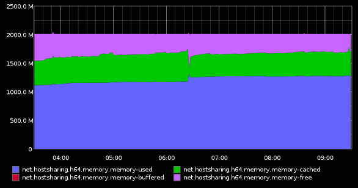
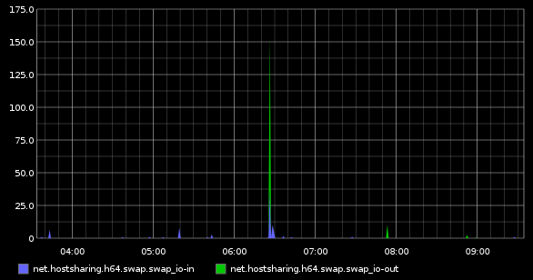

Darstellung
===========

:Authors: - Christian Theune
          - Jens Vagelpohl
          - Michael Hierweck
          - Veit Schiele
:Date: 2013-09-10

Graphing
--------

Das Frontend `graphite-web <https://github.com/graphite-project/graphite-web>`_
scheint gut geeignet zu sein, graphische Darstellungen in Echtzeit zu
erstellen. 

Graphite-web ist jedoch zunächst nicht wirklich gut vorbereitet auf verteiltes
Monitoring:

- das Carbon-Relay trifft die Annahme, dass alle Werte für ``DESTINATIONS`` mit
  derselben IP auch dem selben Host zugehörend an.
- Umgekehrt nimmt Graphite-Web an, dass alle ``CLUSTER_SERVERS``, deren IP
  *lokal* ist, auch tatsächlich eine lokale Instanz sei.

Sollen jedoch entfernete Hosts z.B. über SSL oder `Stunnel
<http://en.wikipedia.org/wiki/Stunnel>`_ miteinander verbunden werden, sind die
oben getroffenen Annahmen falsch.

Um nun doch dem Carbon-Relay verschiedene Hosts unter der lokalen IP
beizubringen, kann z.B. folgendes angegeben werden::

    DESTINATIONS = 127.0.0.1:2004:a,127.0.0.01:2104:a,127.0.0.001:2204:a

Graphite-Web kann mit dem folgenden monkey patch auch für entfernte Hosts mit
einer lokalen IP-Adresse konfiguriert werden::

    from graphite import settings
    from graphite import storage
    from graphite.logger import log
    storage.is_local_interface = lambda (host): False
    storage.STORE = storage.Store(settings.DATA_DIRS,
    remote_hosts=settings.CLUSTER_SERVERS)

Weitere Infos zu *federated graphite* und *carbon dederated storage* finden
sich z.B. unter

- `Federated Storage
  <http://graphite.wikidot.com/federated-storage>`_
- `Richard Crowley’s blog: Federated Graphite
  <http://rcrowley.org/articles/federated-graphite.html>`_
- `hw-cookbooks/graphite/recipes/federated.rb
  <https://github.com/hw-cookbooks/graphite/blob/master/recipes/federated.rb>`_

Dashboard
---------

`Riemann <http://riemann.io/>`_

